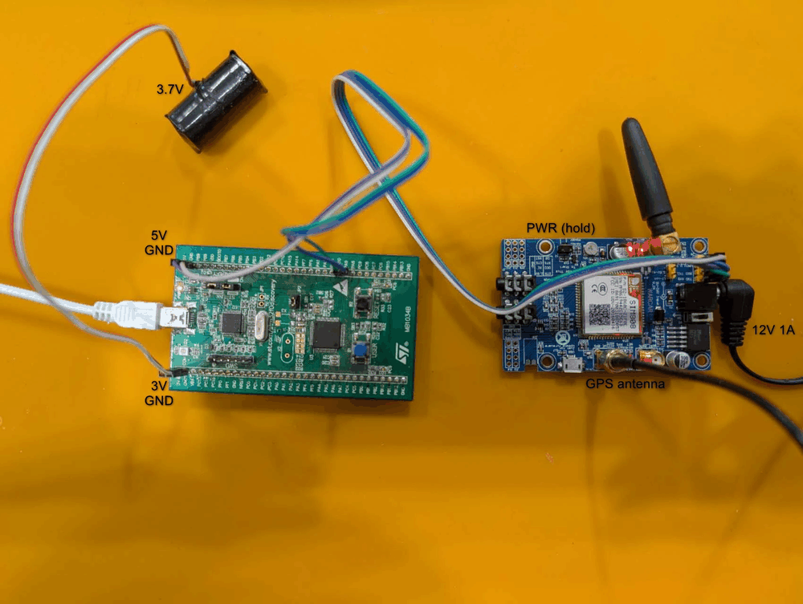

# GPS-трекер: STM32F0DISCOVERY + SIM808

<p align="center">
  
  <br>
  <sub>кабель usb-mini в данный момент к компьютеру не подключен</sub>
</p>

Отправляешь на номер SIM-карты трекера SMS `where` и получаешь в ответ ссылку на карту:

```
https://maps.google.com/?q=55.751244,37.618423
12:00:15 UTC spd 3.2km/h alt 150m sats 7
```

| SMS                     | Ответ                                                                    |
|-------------------------|--------------------------------------------------------------------------|
| `where` (`gde`, `loc`, `?`) | координаты; если фикса сейчас нет — последние известные и их возраст |
| `status`                | уровень GSM, регистрация в сети, питание модуля, состояние GPS, аптайм  |
| `help`                  | список команд                                                            |

Регистр букв не важен. На любые другие SMS трекер не отвечает: иначе он тратил бы деньги на ответы на рассылки оператора.
Больше `CFG_MAX_REPLIES_PER_HOUR` (по умолчанию 20) ответов в час он не отправит.

## Подключение

Плат две: **STM32F0DISCOVERY** (далее «Discovery», на ней прошивка) и **плата модуля SIM808** (далее «SIM808»).
Discovery подключена к компьютеру mini-USB кабелем, SIM808 питается отдельно.
Подписи выводов напечатаны на самих платах рядом со штырьками. На SIM808 они бывают разными, ниже указаны частые варианты.

| Discovery | Провод | SIM808 | Зачем |
|-----------|:------:|--------|-------|
| `PA9`  | → | `RXD` (бывает `RX`, `SIM_RXD`) | Discovery передаёт команды, SIM808 принимает |
| `PA10` | ← | `TXD` (бывает `TX`, `SIM_TXD`) | SIM808 отвечает, Discovery принимает |
| `GND`  | — | `GND` | общая земля, **обязательно** |
| `3V`   | → | `VMCU` (бывает `V_MCU`, `VIO`) | задаёт уровень сигналов UART на плате SIM808 — см. ниже |
| `PB10` | → | `PWRKEY` (бывает `PWR`, `PWX`, `PWK`) | Discovery сама включает модуль; не обязательно |

```
   Discovery                     SIM808                Блок питания 5 В / 2 А
  ┌──────────┐                ┌──────────┐              ┌──────────┐
  │      PA9 ├───────────────>┤ RXD      │              │          │
  │     PA10 ├<───────────────┤ TXD      │   DC 5 В     │          │
  │     PB10 ├───────────────>┤ PWRKEY   ├<─────────────┤ +5V      │
  │       3V ├───────────────>┤ VMCU     │              │          │
  │      GND ├────────────────┤ GND      ├──────────────┤ GND      │
  └────┬─────┘                └──────────┘              └──────────┘
       │ mini-USB
    компьютер
```

Как читать:
- **Земля общая для всех трёх**: Discovery, SIM808 и блока питания модуля. Без общей земли UART работать не будет.
  На Discovery выводов `GND` несколько, подойдёт любой.
- **Плюс блока питания идёт только на SIM808.** С выводами `5V`/`3V` Discovery его не соединяй.

### Плата SIM808 EVB-V3.2

Проверено на этой плате. Её гребёнка 2×4 у разъёма питания — это два разъёма, **J6** (левый столбец) и **J5** (правый):

```
           J6 (левый)   J5 (правый)
строка 1:   TXD          RXD
строка 2:   RXD          TXD
строка 3:   VMCU         V_IN
строка 4:   GND          GND
```

- **Подключать нужно левый столбец J6**: это основной порт с AT-командами и SMS, рядом стоит преобразователь уровней
  (транзисторы Q1/Q2). Правый столбец J5 — второй порт модуля и `V_IN`, его не трогай.
- **PWRKEY на гребёнку не выведен**, так что вывод `PB10` остаётся свободным. Модуль включается кнопкой **S2**
  («Press This To Start»): держать 1–2 с, пока не загорится светодиод STA.
- **Светодиоды:** `PWR` — на плату подано питание (переключатель S3 в «ON»); `STA` — модуль включён;
  `NET` — часто мигает, пока ищет сеть, раз в 3 с — в сети; `PPS` — мигает раз в секунду, когда есть фикс GPS.
- Разъём micro-USB на плате — только для обновления прошивки самого модуля, питание через него не идёт.

### Общее для любых плат SIM808

- **Питание SIM808 — отдельное.** При передаче GSM модуль берёт импульсы до 2 А, от выводов 3V/5V Discovery он работать не будет:
  перезагрузки, `UNDER-VOLTAGE POWER DOWN`. На плате модуля обычно есть вход DC (разъём или выводы `VIN`/`5V`),
  туда нужен блок питания на 5 В и не меньше 2 А. Можно и Li-ion аккумулятор 3.7 В на вывод `VBAT`. Discovery питается от USB.
- **Две пары TXD/RXD.** Нужна пара **основного (GSM) порта** — по нему идут AT-команды
  и SMS. Обычно она стоит рядом с выводом `VMCU`. Вторая пара — порт GPS/отладки, команд он не понимает.
  Перепутать не опасно: если трекер не отвечает, в логе будет
  `SIM808 does not answer`.
- **VMCU.** На плате стоит преобразователь уровней, и `VMCU` говорит ему, с каким напряжением работает
  управляющая плата. Подай на него `3V` с Discovery — тогда сигналы `TXD`/`RXD` будут того же уровня, что у STM32.
  Без `VMCU` преобразователь может не работать, и модуль будет «молчать».
- **Уровни UART.** UART у SIM808 2.8-вольтовый. Процессор Discovery питается от ~2.85 В (OpenOCD показывает это как
  `Target voltage`), поэтому и его выход `PA9` выдаёт ~2.85 В — это подходит модулю без делителя, даже если у его платы
  нет преобразователя уровней. Вход `PA10` выдерживает 5 В, так что обратная линия тоже подключается напрямую.
- **PWRKEY.** Трекер сначала шлёт `AT`. Если модуль молчит, прошивка «нажимает» PWRKEY: 1.5 с прижимает вывод к земле.
  PB10 работает как открытый сток и выдерживает 5 В, поэтому его можно подключать прямо к PWRKEY модуля.
  Если PWRKEY не подключать, модуль SIM808 необходимо включить кнопкой на его плате.
- **Антенны.** Первый фикс под открытым небом
  приходит за 30 с – несколько минут, в помещении его может не быть вовсе.
- **SIM-карта.** С сим-карты снять PIN-код.
  Прошивка удаляет каждую прочитанную SMS, чтобы не переполнялась память, так что лучше отдельная карта.

## Светодиоды

- Зелёный (PC9): короткая вспышка раз в 2 с — спутников нет; мигает раз в секунду — фикс есть.
- Синий (PC8): горит при запуске модуля и отправке SMS; мигает раз в секунду — модуль не отвечает, трекер повторит попытку через 10 с.

## Настройка

В самом начале необходимо вписать свои номера, иначе местоположение сможет узнать любой, кто напишет `where`.
Номера хранятся в отдельном файле `src/allowed_numbers.h`. (в `.gitignore`). Можно создать из шаблона:

```bash
cp src/allowed_numbers.example.h src/allowed_numbers.h
```

```c
#define CFG_ALLOWED_NUMBERS "+79161234567", "+79035550000", NULL
```

Номера сравниваются по последним 10 цифрам, поэтому `+7916...` и `8916...` считаются одним номером.
Без `src/allowed_numbers.h` прошивка соберётся, но с предупреждением при сборке, и будет отвечать любому номеру.

Остальные настройки (скорости UART, интервалы опроса, лимит ответов в час) лежат в [src/config.hpp](src/config.hpp).

## Сборка

Код написан на C++20. Нужны [Arm GNU Toolchain](https://developer.arm.com/downloads/-/arm-gnu-toolchain-downloads) (`arm-none-eabi-g++` 10 или новее), CMake ≥ 3.22 и Ninja:

```bash
winget install Arm.GnuArmEmbeddedToolchain Ninja-build.Ninja
```

```bash
cmake --preset firmware
```

```bash
cmake --build --preset firmware
```

Результат лежит в `build/firmware/`: `gps_tracker.elf`, `.hex` и `.bin`. Прошивка занимает около 17 КБ flash из 64.
Заголовки CMSIS (ядро Cortex-M0 и STM32F0) CMake скачивает сам при первой настройке.
HAL не используется, только регистры.

C++ здесь без того, что на микроконтроллере с 8 КБ RAM только мешает: исключения, RTTI и куча выключены
(`-fno-exceptions -fno-rtti`, `new` и `malloc` не вызываются). Строки — `std::string_view` и `Text<N>`
фиксированного размера на стеке, необязательные результаты — `std::optional`.
Все глобальные объекты инициализируются на этапе компиляции, конструкторов при старте нет.

Если `arm-none-eabi-gcc` не в PATH: `cmake --preset firmware -DARM_TOOLCHAIN_DIR="C:/путь/к/toolchain/bin"`.

## Прошивка

Discovery подключается по USB (mini-USB, встроенный ST-LINK/V2). Нужен драйвер ST-LINK: после его установки
в диспетчере устройств в разделе «Устройства USB» появляется «STM32 STLink».

Удобнее всего через [OpenOCD](https://xpack-dev-tools.github.io/openocd-xpack/) (проверено на xPack 0.12.0).
Если он не в PATH, путь к нему задаётся в `CMakeUserPresets.json` — это локальный файл этой машины, он в `.gitignore`:

```json
{
  "version": 3,
  "configurePresets": [
    { "name": "firmware-local", "inherits": "firmware",
      "cacheVariables": { "OPENOCD": "D:/Programs/_Embedded/xpack-openocd-0.12.0-2/bin/openocd.exe" } }
  ],
  "buildPresets": [ { "name": "firmware-local", "configurePreset": "firmware-local" } ]
}
```

```bash
cmake --preset firmware-local
```

```bash
cmake --build --preset firmware-local --target flash
```

Цель `flash` собирает прошивку, записывает её, сверяет (`** Verified OK **`) и перезапускает плату.
Можно и вручную в STM32CubeProgrammer: открыть `build/firmware/gps_tracker.hex` и нажать Download.

## Отладочный лог

Лог пишется сразу в два места, выбирай любое.

**Через ST-LINK (RTT), без лишних проводов.** Прошивка складывает строки в буфер на 1 КБ в RAM, а OpenOCD забирает их
через тот же USB-кабель, не останавливая плату. Нужен только Python 3:

```bash
cmake --build --preset firmware-local --target log
```

или напрямую — с ключом `--reset` плата перезапустится, и лог будет виден с самого старта:

```bash
python tools/rtt_log.py --openocd D:/Programs/_Embedded/xpack-openocd-0.12.0-2/bin/openocd.exe --reset
```

Выход — Ctrl+C, прошивка при этом продолжает работать. Пока лог никто не читает, буфер заполняется, и новые строки
отбрасываются — на работу трекера это не влияет.

**Через USB-UART переходник.** RX переходника на `PA2` Discovery, общий GND, 115200 8N1.

Пример лога:

```
[    0.000] gps-tracker start, reset: power-on
[    0.004] WARNING: src/allowed_numbers.h is empty or missing, anyone can request the location
[    1.512] SIM808 answers
[    1.530] module: SIM808 R14.18
[   42.120] GPS fix, sats 6
[   97.004] SMS #1 from +79161234567: where
[  101.870] reply to +79161234567 sent
```

## Тесты

Строки, кольцевой буфер, RTT-буфер, парсеры `+CGNSINF`/SMS и тексты ответов написаны без привязки к железу и проверяются на ПК любым компилятором C++20 (MSVC 2022, gcc 10+, clang 13+):

```bash
cmake --preset tests
```

```bash
cmake --build --preset tests
```

```bash
ctest --preset tests
```

## Устройство кода

| Файл | Что делает |
|------|------------|
| `src/main.cpp` | класс `Tracker`: главный цикл, опрос GPS раз в 5 с, обработка входящих SMS, перезапуск модуля, если он пропал |
| `src/sim808.cpp` | команды модуля: включение, настройка SMS, GNSS, чтение/удаление/отправка SMS, CSQ/CREG/CBC |
| `src/at.cpp` | AT-движок: строки из UART, ответы на команды, URC (`+CMTI`), приглашение `> ` |
| `src/uart.cpp` | USART1 к модулю (приём по прерыванию в кольцевой буфер 512 Б), USART2 для лога |
| `src/ring_buffer.hpp` | шаблон кольцевого буфера «прерывание пишет — главный цикл читает» |
| `src/rtt.cpp` | отладочный лог через ST-LINK по протоколу SEGGER RTT |
| `src/board.cpp` | такты 48 МГц от HSI, SysTick 1 мс, сторожевой таймер ~6.5 с, светодиоды, PWRKEY |
| `src/text.cpp` | `Text<N>` — строка фиксированного размера без кучи, помощники разбора текста |
| `src/gps.cpp` | разбор `+CGNSINF`, координаты в целых микроградусах (FPU у F0 нет) |
| `src/sms.cpp` | разбор `+CMTI`/`+CMGL`/`+CMGR`, команд и белого списка номеров |
| `src/report.cpp` | тексты SMS-ответов (не длиннее 160 символов) |
| `src/config.hpp` | настройки: скорости, интервалы, лимит ответов |
| `src/startup.cpp`, `src/syscalls.cpp`, `linker/` | таблица векторов, заглушки newlib и карта памяти STM32F051R8 |
| `tools/rtt_log.py` | запускает OpenOCD и показывает RTT-лог в терминале |

Если что-то зависнет больше чем на 6.5 с, сторожевой таймер перезагрузит плату. После перезагрузки в логе будет `reset: WATCHDOG`.
